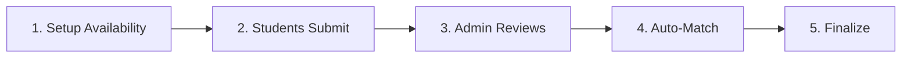

# ⚡ QUICK START - Availability & Matching System

## 🎯 **ONE-MINUTE GUIDE**

### **Open the System**
```
1. Click "APPE Experience Hub" in navigation
2. Go to "Data Management" tab
3. Click "📅 Open Availability Calendar"
```

---

## 🔧 **ADMIN QUICK ACTIONS**

### ✏️ **Edit Preceptor Availability**
```
Preceptor Availability → Edit button → Check periods → Save
```

### ✏️ **Edit Site Availability**  
```
Site Availability → Edit button → Check periods → Set capacity → Save
```

### ➕ **Add Time Period**
```
Top right "➕ Add Time Period" → Fill dates → Save
```

### 🤖 **Run Auto-Match**
```
Any view → "🤖 Auto-Match Students" button → View results → Export
```

---

## 👨‍🎓 **STUDENT QUICK ACTIONS**

### 📝 **Submit Preferences** (Student Portal)
```
1. Open student-portal.html
2. Enter University ID
3. Fill personal info (10 fields)
4. Select time period
5. Rank 5 rotations
6. Rank 3 preceptors (optional)
7. Submit
```

### 📝 **Submit Preferences** (APPE Hub - Admin can do for students)
```
Availability Calendar → Student Preferences → Select student → 
Choose period → Rank rotations → Rank preceptors → Submit
```

---

## 📊 **VIEW DATA**

### See Who's Available When
```
Preceptor Availability table:
✅ = Available in that period
❌ = Not available
```

### Check Capacity
```
Site Availability table:
Shows capacity per period for each site
```

### Review Submissions
```
Data Management → "📥 Review Submissions"
See all student preferences and personal info
```

---

## 🎓 **4 TIME PERIODS (Spring 2026)**

| Period | Dates | Weeks |
|--------|-------|-------|
| **Period 1** | Jan 15 - Feb 26 | 6 |
| **Period 2** | Mar 01 - Apr 12 | 6 |
| **Period 3** | Apr 15 - May 27 | 6 |
| **Period 4** | Jun 01 - Jul 13 | 6 |

---

## ✅ **COMPLETE WORKFLOW (5 Steps)**



1. **Setup** → Edit preceptor & site availability
2. **Submit** → Students choose periods & preferences  
3. **Review** → Check submissions for completeness
4. **Match** → Run auto-matching algorithm
5. **Finalize** → Edit assignments, print letters

---

## 🚨 **TROUBLESHOOTING**

### ❌ **"No preceptors available"**
- **Fix:** Go to Preceptor Availability → Edit each preceptor → Check more periods

### ❌ **"Failed to match X students"**
- **Fix:** Some students picked periods with no available preceptors
- **Solution:** Edit preceptor availability OR ask students to pick different period

### ❌ **"Student can't see preferences form"**
- **Fix:** Make sure student completed Step 1 (personal info) first
- **Or:** Use APPE Hub → Student Preferences to submit for them

---

## 🔑 **KEY BUTTONS**

| Button | Action |
|--------|--------|
| **📅 Open Availability Calendar** | Opens main availability system |
| **✏️ Edit** (preceptor/site) | Modify availability & capacity |
| **➕ Add Time Period** | Create new rotation period |
| **🗑️ Delete** (time period) | Remove period (use carefully!) |
| **🤖 Auto-Match Students** | Run matching algorithm |
| **📥 Export Results** | Download match results to Excel |
| **📥 Review Submissions** | See all student data |

---

## 📚 **FULL DOCUMENTATION**

- **Complete Guide:** `AVAILABILITY_SYSTEM_GUIDE.md`
- **Automation:** `APPE_AUTOMATION_GUIDE.md`  
- **Fancy Features:** `FANCY_FEATURES.md`

---

**Last Updated:** January 12, 2026  
**Quick Help:** This system ensures students only matched with available preceptors/sites! ✅
